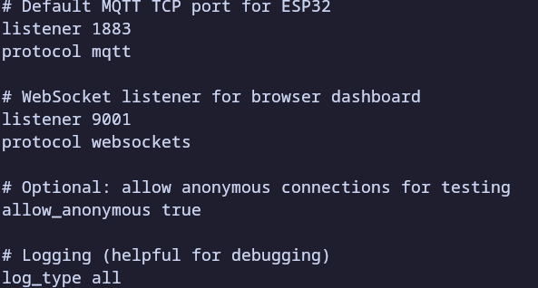

# Mosquitto MQTT Broker Setup
## What is MQTT ?
** MQTT (Message Queuing Telementry Transport)** is lightweight communication protocol used in Iot systems.
[MQTT](https://mqtt.org/software/)

It follws a **publish/subscribe model**:
- A device **publishes ** data to a topic
- Other components **subscribe** to that topic to receive data 
This makes MQTT:
- Efficient (low bandwidh usage)
- Scalable (multiple devices can commuicate easily)
- Decoupled (devices don't need direct connection)
### What is Mosquitto?

**Mosquitto** is an open-source MQTT broker

It acts as a **middleman**:
- Receives messages from the ESP32  
- Sends them to subscribers (backend, dashboard, etc.)

### Why is it needed?
In this project:
- ESP32 publishes sensor data  
- Mosquitto routes the data   

Without Mosquitto, components cannot communicate

## Configuration

By default, Mosquitto only accepts local connections
We must allow access from other devices (ESP32)

Edit configuration file:

## Explanation
listener 1883 0.0.0.0 ,this allows connections from the network
allow_anonymous true so no authentication (for demo only)
persistence true ,this saves data across restarts

