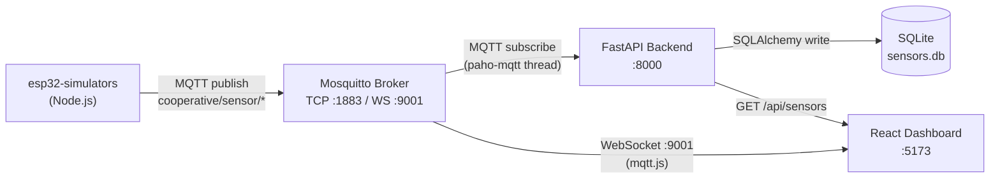
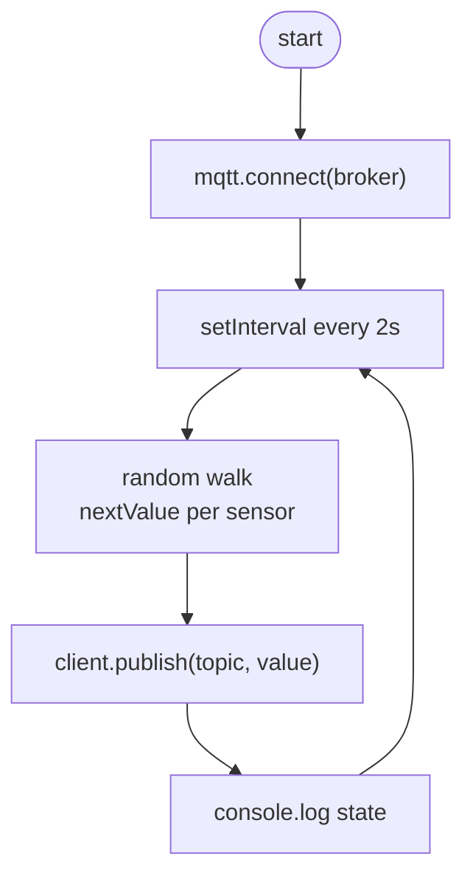
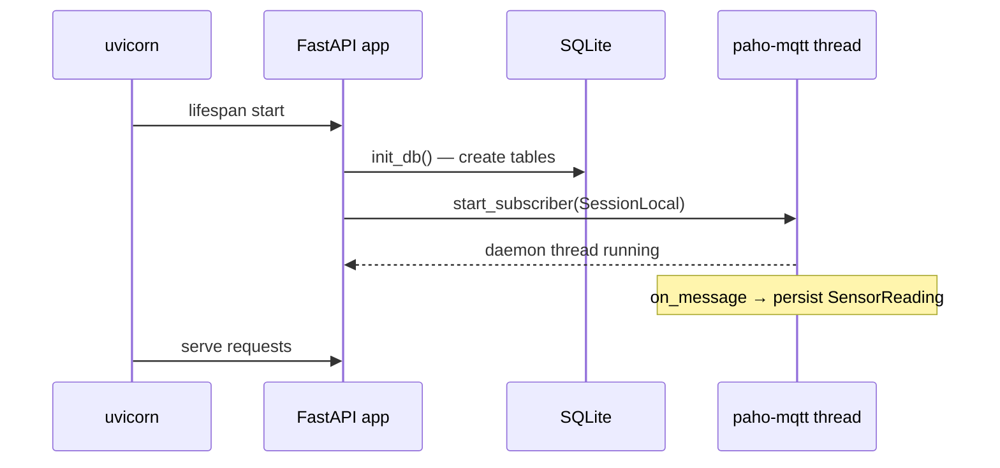
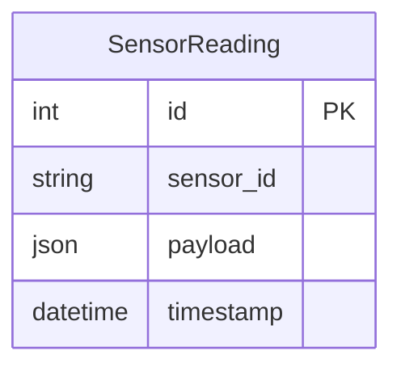

# Sprint: ESP32 Simulators Implementation

## Objective

Replace hardware ESP32 dependency with a Node.js software simulator so the full data pipeline can be developed and tested without physical devices.

---

## Status: DONE ✅

| Task | Status |
|------|--------|
| Plan simulator architecture | ✅ |
| Node.js MQTT publisher (`esp32-simulators/`) | ✅ |
| Backend database layer (SQLite + SQLAlchemy) | ✅ |
| Backend MQTT subscriber (paho-mqtt) | ✅ |
| FastAPI REST endpoints | ✅ |
| `requirements.txt` | ✅ |

---

## Context

1. A backend scaffold existed with an empty `app/` and a `SensorReading` SQLAlchemy model.
2. A React frontend existed with `MqttManager.js` already subscribing to `cooperative/sensor/*` topics with a mock-data fallback.
3. The original ESP32 firmware published to `esp32/sensors` — topic mismatch with the frontend.

---

## Architecture

### Full Data Flow



### Simulator Internal Logic



### Backend Startup Sequence



### REST API



**Endpoints:**

| Method | Path | Description |
|--------|------|-------------|
| `GET` | `/health` | Liveness check |
| `GET` | `/api/sensors/` | All readings (filterable by `sensor_id`, `limit`) |
| `GET` | `/api/sensors/latest` | Latest reading per sensor |

---

## File Layout

```
esp32-simulators/
  package.json          # mqtt dependency, ESM
  index.js              # random-walk publisher

backend/
  requirements.txt      # fastapi, uvicorn, sqlalchemy, paho-mqtt, python-dotenv
  app/
    main.py             # FastAPI app, CORS, lifespan
    config.py           # env var reads
    database.py         # SQLite engine, SessionLocal, init_db
    mqtt_subscriber.py  # paho-mqtt thread — subscribe & persist
    models/
      sensor_reading.py # SensorReading ORM model
    routers/
      sensors.py        # /api/sensors REST routes
```

---

## How to Run

### 1. Start Mosquitto

```bash
mosquitto -c mosquitto.conf
# needs listener 1883 and WebSocket listener 9001
```

### 2. Start the Simulator

```bash
cd esp32-simulators
npm install
npm start
# env: MQTT_BROKER_URL=mqtt://localhost:1883  (default)
#      PUBLISH_INTERVAL_MS=2000               (default)
```

### 3. Start the Backend

```bash
cd backend
pip install -r requirements.txt
uvicorn app.main:app --reload --host 0.0.0.0 --port 8000
# env: MQTT_BROKER_HOST=localhost  (default)
#      MQTT_BROKER_PORT=1883       (default)
```

### 4. Start the Frontend

```bash
cd frontend
npm install
npm run dev
# connects to ws://localhost:9001 for live sensor values
```

---

## Design Decisions

- **SQLite** chosen over PostgreSQL for zero-setup local dev; swap `DATABASE_URL` for Postgres in production.
- **Random walk** (`±5 % of range per tick`) keeps simulated values physically plausible across consecutive readings instead of pure noise.
- **Daemon thread** for the paho-mqtt loop means it shuts down automatically when the FastAPI process exits.
- **No Alembic** at this stage — `init_db()` calls `Base.metadata.create_all` directly. Alembic migrations are deferred to the auth/persistence sprint.
- Frontend **mock-mode fallback** (already in `MqttManager.js`) remains untouched — it activates only when the broker is unreachable.

---

## TODO — Next Sprints

- [x] **Sprint 02** — Auth (JWT login, protected routes, user model) → `designDocs/02_Auth/sprint.md`
- [x] **Sprint 03** — Historical charts in the frontend (REST polling `GET /api/sensors/`)
- [x] **Sprint 04** — Multi-device support: simulator instances per device ID, `device_id` column on `SensorReading`
- [x] **Sprint 05** — Docker Compose: mosquitto + backend + frontend in one `docker-compose.yml`
- [x] **Sprint 06** — Alembic migrations, switch to PostgreSQL for production
