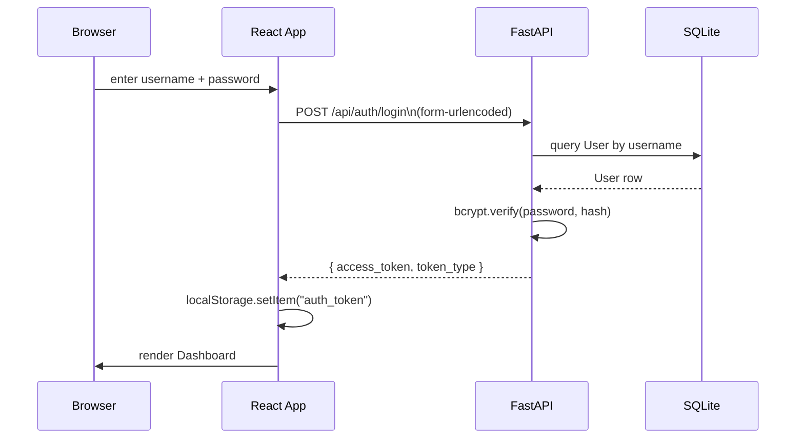
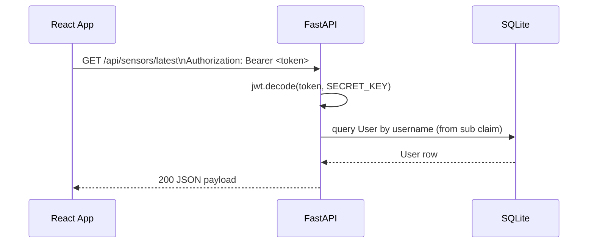
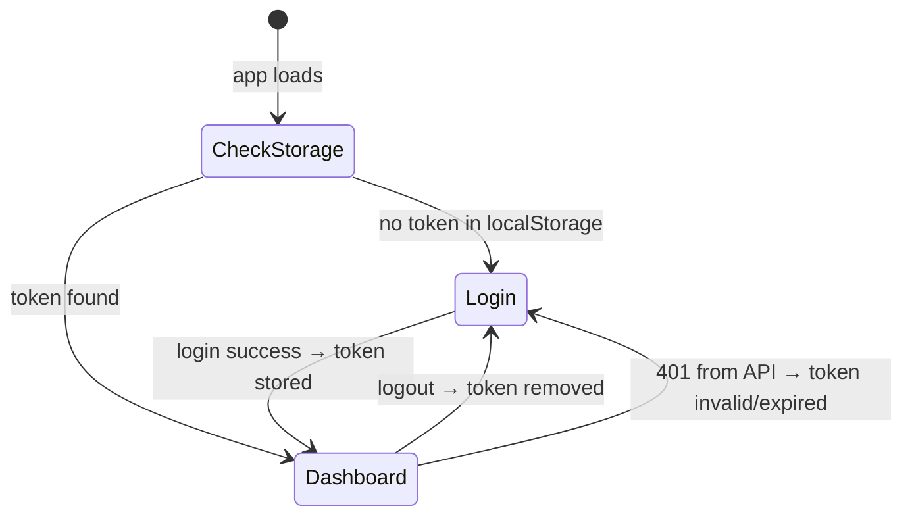
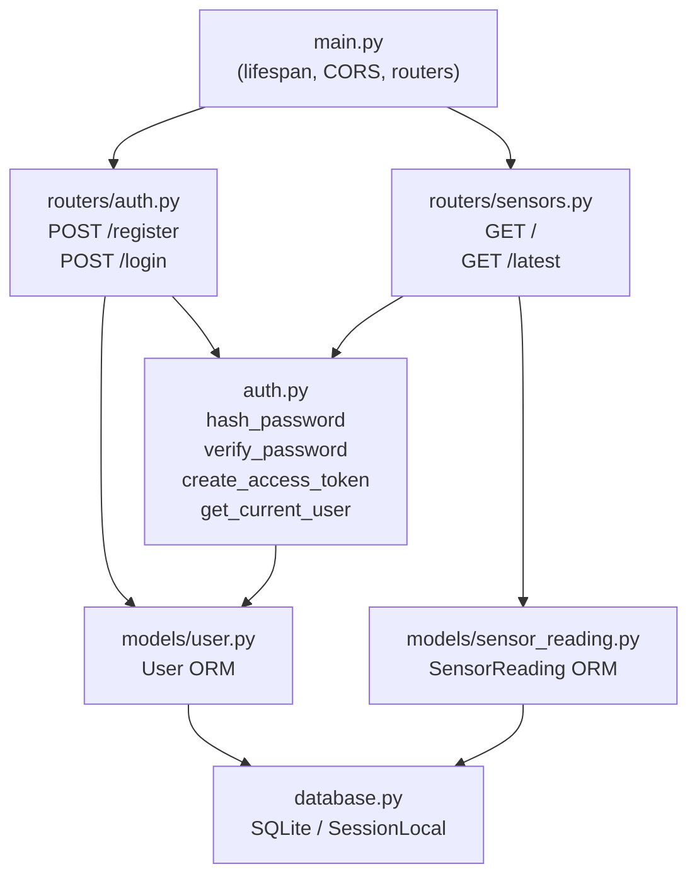
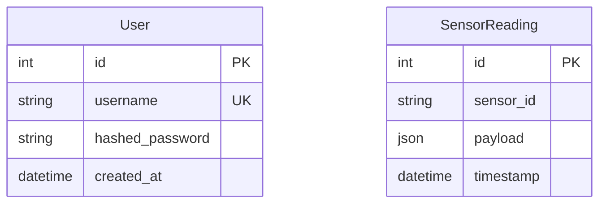

# Sprint 02: Authentication

## Objective

Add JWT-based authentication so only logged-in users can access the sensor dashboard and the REST API.

---

## Status: DONE ✅

| Task | Status |
|------|--------|
| `User` SQLAlchemy model | ✅ |
| Password hashing (bcrypt via passlib) | ✅ |
| JWT encode/decode (python-jose) | ✅ |
| `POST /api/auth/register` | ✅ |
| `POST /api/auth/login` → returns Bearer token | ✅ |
| `get_current_user` dependency on sensor routes | ✅ |
| `AuthContext.jsx` — React context + provider | ✅ |
| `LoginPage.jsx` — login form UI | ✅ |
| Auth gate in `App.jsx` | ✅ |
| Sign-out button in dashboard header | ✅ |
| Login page CSS | ✅ |

---

## Architecture

### Auth Flow — Login



### Auth Flow — Protected API Call



### Frontend State Machine



### Backend Module Layout



### Data Models



---

## File Changes

```
backend/
  requirements.txt          + passlib[bcrypt], python-jose[cryptography]
  app/
    auth.py                 NEW — hashing, JWT, get_current_user dependency
    models/
      user.py               NEW — User ORM model
    routers/
      auth.py               NEW — /register, /login
      sensors.py            UPDATED — Depends(get_current_user) on both routes
    main.py                 UPDATED — include auth router

frontend/
  src/
    AuthContext.jsx         NEW — token state, login(), logout(), useAuth()
    pages/
      LoginPage.jsx         NEW — login form with error display
    App.jsx                 UPDATED — auth gate, logout button, Dashboard rename
    main.jsx                UPDATED — wrapped in <AuthProvider>
    styles.css              UPDATED — login-shell, login-card, field, login-error
```

---

## Design Decisions

- **`OAuth2PasswordRequestForm`** — `POST /api/auth/login` accepts `application/x-www-form-urlencoded` which is the OAuth2 standard and works natively with FastAPI's auto-generated Swagger UI "Authorize" button.
- **8-hour sessions** — long enough for a working shift; no refresh token at this stage.
- **`localStorage`** for token persistence — simple for dev; move to `httpOnly` cookie when TLS is in place.
- **No role system yet** — all authenticated users have full read access. Admin/operator roles deferred to Sprint 04.
- **Register endpoint is open** — acceptable during development; lock to admin-only before production.

---

## API Reference

### `POST /api/auth/register`
Body (JSON):
```json
{ "username": "operator1", "password": "secret" }
```
Response `201`:
```json
{ "id": 1, "username": "operator1", "created_at": "2026-04-23T..." }
```

### `POST /api/auth/login`
Body (`application/x-www-form-urlencoded`):
```
username=operator1&password=secret
```
Response `200`:
```json
{ "access_token": "<JWT>", "token_type": "bearer" }
```

### Protected routes
Pass `Authorization: Bearer <token>` header on `GET /api/sensors/` and `GET /api/sensors/latest`.

---

## TODO — Next Sprints

- [x] **Sprint 01** — ESP32 Simulator (Node.js MQTT publisher, SQLite persistence)
- [x] **Sprint 02** — Auth (JWT login, protected routes, user model) ← **current**
- [x] **Sprint 03** — Historical charts in the frontend (REST polling `GET /api/sensors/`) → `designDocs/03_HistoricalCharts/sprint.md`
- [x] **Sprint 04** — Multi-device support: simulator instances per device ID, `device_id` column on `SensorReading`
- [x] **Sprint 05** — Docker Compose: mosquitto + backend + frontend in one `docker-compose.yml`
- [x] **Sprint 06** — Alembic migrations, switch to PostgreSQL for production
