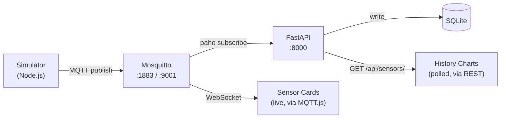
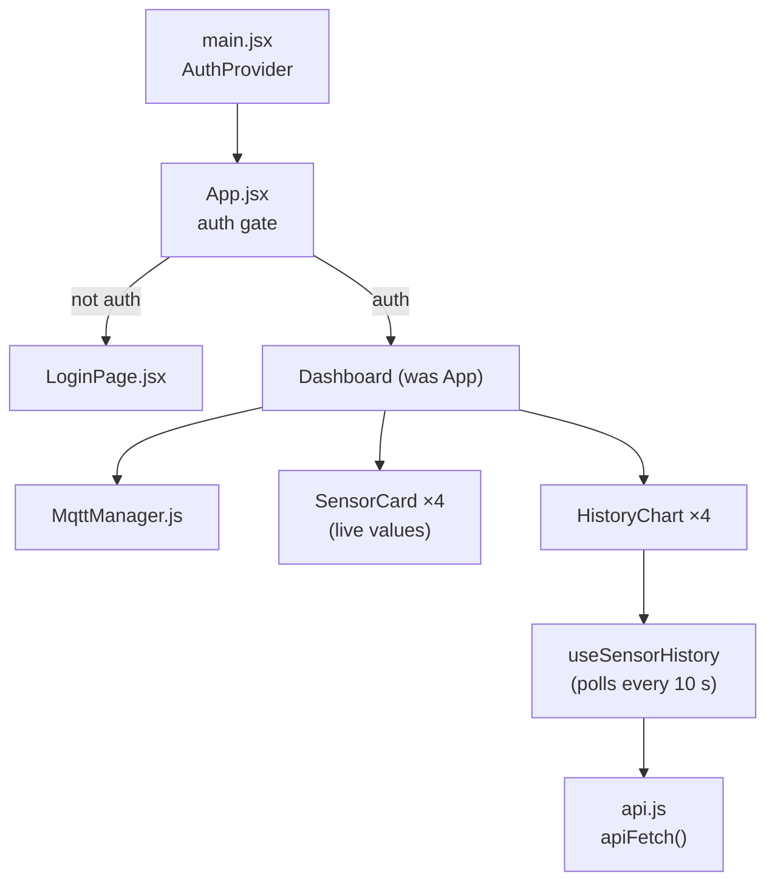
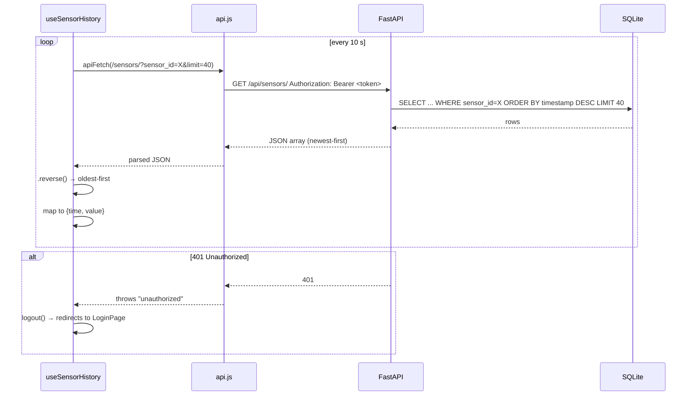
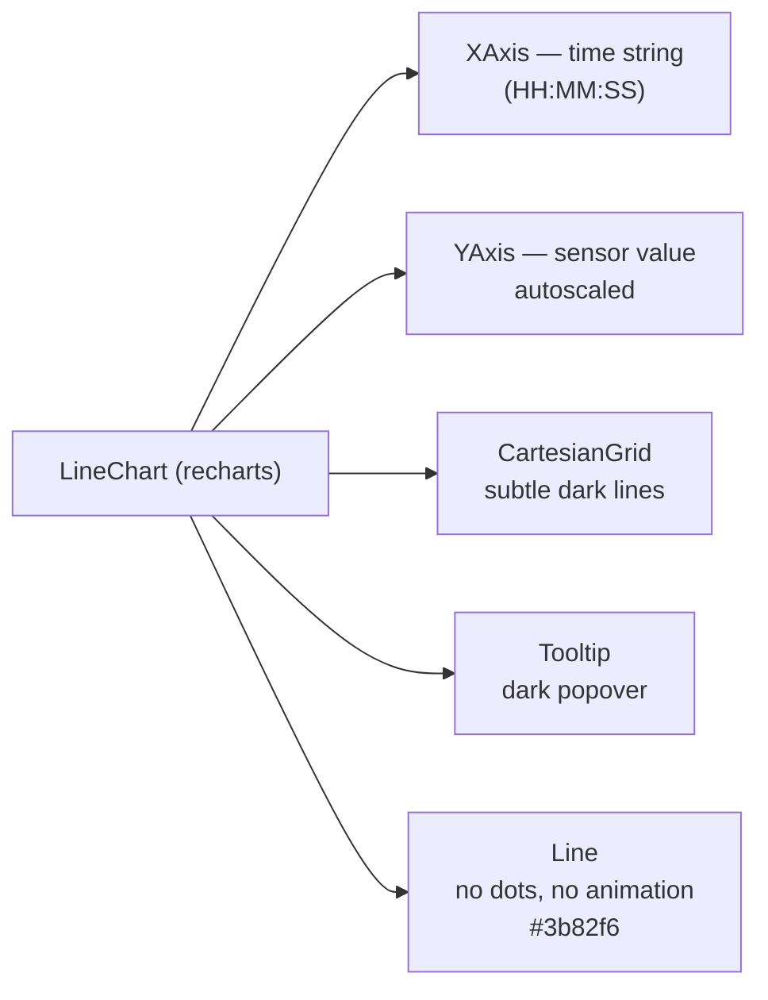

# Sprint 03: Historical Charts

## Objective

Add a history section to the dashboard that polls the REST API and renders a time-series line chart for each sensor's last 40 readings.

---

## Status: DONE ✅

| Task | Status |
|------|--------|
| `recharts` dependency | ✅ |
| `api.js` — authenticated fetch utility | ✅ |
| `useSensorHistory` polling hook | ✅ |
| Auto-logout on expired token (401) | ✅ |
| `HistoryChart.jsx` — recharts `LineChart` | ✅ |
| Charts section wired into `App.jsx` | ✅ |
| Chart CSS (dark theme, 2-col grid) | ✅ |

---

## Architecture

### Data Flow — Live vs Historical



### Frontend Component Tree



### Polling Sequence



### Chart Anatomy



---

## File Changes

```
frontend/
  package.json              + recharts ^2.12.7
  src/
    api.js                  NEW — apiFetch(path, token) — throws "unauthorized" on 401
    hooks/
      useSensorHistory.js   NEW — polls /api/sensors/, reverses array, auto-logout on 401
    components/
      HistoryChart.jsx       NEW — recharts LineChart per sensor
    App.jsx                 UPDATED — import HistoryChart, add charts-panel section
    styles.css              UPDATED — charts-panel, charts-grid, history-chart styles
```

---

## Design Decisions

- **Separate concerns**: live values come from MQTT (push), history comes from REST (pull). The two pipelines are independent — charts work even if the MQTT connection drops.
- **Poll interval: 10 s** — history is not real-time; new readings arrive every 2 s from the simulator but the chart showing last 40 points updates every 10 s to avoid spamming the API.
- **`isAnimationActive={false}`** on the recharts `Line` — prevents the chart from re-animating on every poll cycle, which would be visually noisy.
- **Auto-logout on 401** — `useSensorHistory` catches `"unauthorized"` errors and calls `logout()`, which clears the token and returns the user to the login page.
- **`limit=40`** default — enough for ~1.3 minutes of simulator history at 2 s intervals; adjustable via the hook's third argument.

---

## TODO — Next Sprints

- [x] **Sprint 01** — ESP32 Simulator
- [x] **Sprint 02** — Auth (JWT login, protected routes)
- [x] **Sprint 03** — Historical charts ← **current**
- [x] **Sprint 04** — Multi-device support: `device_id` on `SensorReading`, multiple simulator instances → `designDocs/04_MultiDeviceSimulator/sprint.md`
- [x] **Sprint 05** — Docker Compose: mosquitto + backend + frontend
- [x] **Sprint 06** — Alembic migrations, PostgreSQL for production
