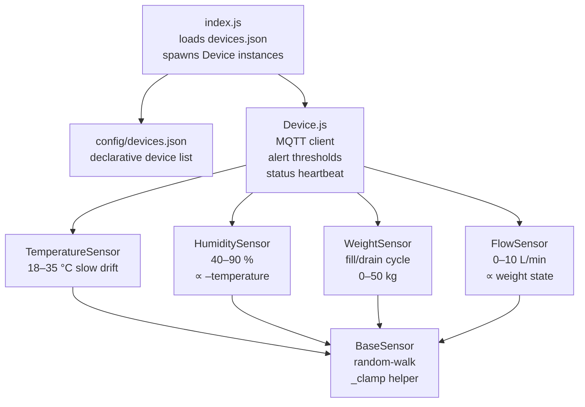
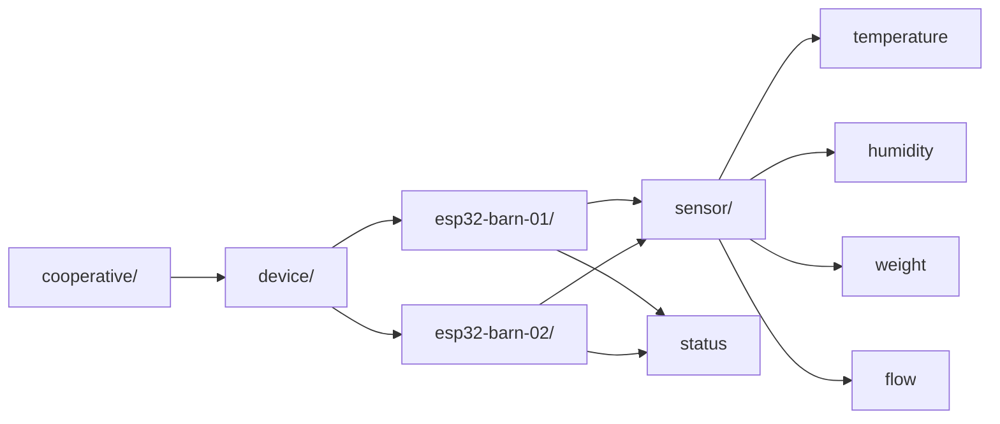
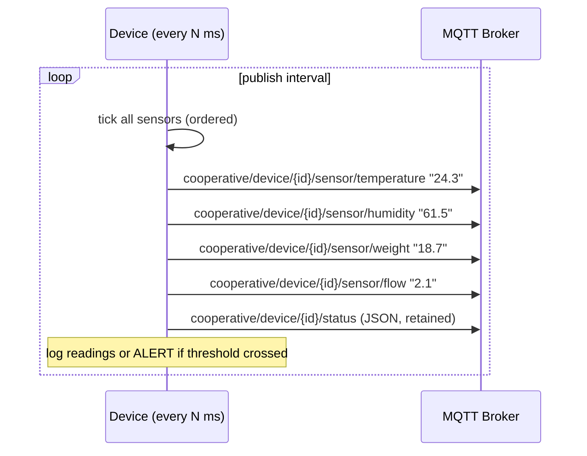

# Sprint 04: Multi-Device ESP32 Simulator

## Objective

Replace the flat single-file simulator with a properly architected, multi-device system. Each device instance simulates a physical ESP32 with realistic sensor physics and publishes to a per-device MQTT topic hierarchy.

---

## Status: DONE ✅

| Task | Status |
|------|--------|
| `BaseSensor` — random-walk base class | ✅ |
| `TemperatureSensor` — slow thermal drift | ✅ |
| `HumiditySensor` — inversely correlated with temperature | ✅ |
| `WeightSensor` — fill/drain production cycle | ✅ |
| `FlowSensor` — derived from weight state | ✅ |
| `Device` — MQTT client, alert thresholds, status heartbeat | ✅ |
| `config/devices.json` — declarative device list | ✅ |
| `index.js` — spawns one `Device` per config entry | ✅ |
| Backend: `device_id` on `SensorReading` | ✅ |
| Backend: wildcard topic subscription | ✅ |
| Backend: `GET /api/sensors/devices` endpoint | ✅ |
| Backend: `device_id` filter on `/api/sensors/` and `/api/sensors/latest` | ✅ |
| Frontend: `parseSensorTopic()` replaces hardcoded topic map | ✅ |
| Frontend: `MqttManager` subscribes to `cooperative/device/+/sensor/+` | ✅ |

---

## Architecture

### Simulator Module Structure



### Sensor Physics

```mermaid
flowchart LR
    subgraph TemperatureSensor
        T_WALK["random walk\n±0.02 × range / tick"]
    end

    subgraph HumiditySensor
        H_WALK["random walk"] --> H_CORR["+ thermal influence\n−0.08 × tempDeviation"]
    end

    subgraph WeightSensor
        W_STATE{draining?}
        W_STATE -->|yes| W_DRAIN["−4 kg/tick\nuntil ≤ 0.5 kg"]
        W_STATE -->|no| W_FILL["+0.35 kg/tick + noise"]
        W_FILL -->|≥ fillTarget| W_STATE
        W_DRAIN -->|weight ≤ 0.5| W_STATE
    end

    subgraph FlowSensor
        F_STATE{draining?}
        F_STATE -->|yes| F_ZERO["trickle\n0–0.25 L/min"]
        F_STATE -->|no| F_INFLOW["inflow\n∝ weight delta"]
    end

    WeightSensor -->|isDraining()| FlowSensor
    TemperatureSensor -->|read()| HumiditySensor
```

### MQTT Topic Hierarchy



### Device Publish Cycle



### Alert Thresholds

| Sensor | Warning | Critical |
|--------|---------|----------|
| temperature | ≥ 30 °C | ≥ 33 °C |
| humidity | ≥ 80 % | ≥ 87 % |
| weight | ≥ 44 kg | ≥ 48 kg |
| flow | ≥ 7 L/min | ≥ 9 L/min |

---

## Backend Changes

### Topic Parser

```
cooperative/device/esp32-barn-01/sensor/temperature
              ↓
device_id = "esp32-barn-01"
sensor_id = "temperature"
```

### Schema Change

`SensorReading` now has a `device_id` column (indexed). **Delete `backend/sensors.db` before restarting** — `init_db()` uses `create_all`, not Alembic, so it won't migrate an existing database.

### New Endpoints

| Method | Path | Description |
|--------|------|-------------|
| `GET` | `/api/sensors/devices` | Distinct device IDs seen in DB |
| `GET` | `/api/sensors/?device_id=X` | Filter readings by device |
| `GET` | `/api/sensors/latest?device_id=X` | Latest per sensor for a specific device |

---

## Frontend Changes

`config.js` exports `DEVICE_TOPIC_WILDCARD = 'cooperative/device/+/sensor/+'` and `parseSensorTopic(topic)`.

`MqttManager.js` now does one wildcard subscribe instead of four individual subscribes, and uses `parseSensorTopic` to resolve sensor key from the incoming topic. Dashboard sensor cards show the latest value aggregated across all devices (last writer wins) — per-device views are deferred to a future sprint.

---

## File Changes

```
esp32-simulators/
  index.js                       REWRITTEN — spawns from devices.json
  config/
    devices.json                 NEW — declarative device list
  src/
    Device.js                    NEW — MQTT + sensors + alerts + heartbeat
    sensors/
      BaseSensor.js              NEW
      TemperatureSensor.js       NEW
      HumiditySensor.js          NEW — correlated with temp
      WeightSensor.js            NEW — fill/drain production cycle
      FlowSensor.js              NEW — correlated with weight state

backend/app/
  models/sensor_reading.py       + device_id column
  mqtt_subscriber.py             REWRITTEN — wildcard topic, topic parser
  routers/sensors.py             + device_id filter, GET /devices

frontend/src/
  config.js                      + DEVICE_TOPIC_WILDCARD, parseSensorTopic()
  MqttManager.js                 UPDATED — wildcard subscribe, parseSensorTopic
```

---

## TODO — Next Sprints

- [x] **Sprint 01** — ESP32 Simulator (basic)
- [x] **Sprint 02** — Auth (JWT login, protected routes)
- [x] **Sprint 03** — Historical charts
- [x] **Sprint 04** — Multi-device simulator ← **current**
- [ ] **Sprint 05** — Docker Compose: mosquitto + backend + frontend
- [ ] **Sprint 06** — Alembic migrations, PostgreSQL for production
