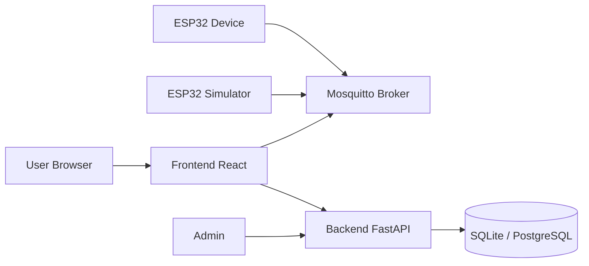

# Use Case Diagram

What this shows
- Actors that interact with the system (devices, simulators, users, admin) and their primary actions.
- Real-time channel (MQTT broker) vs REST channel (backend API) are explicit.

Why this matters
- For a PFE jury this quickly demonstrates who the system serves and the core capabilities implemented now: real-time ingestion, dashboard viewing, and basic admin operations.

How to present this to a jury
- Start by pointing at the actors (ESP32 / Simulator vs Human actors) and explain their entry points.
- Emphasize that devices publish to a broker; the frontend subscribes directly via WebSocket while the backend has a subscriber that persists readings.
- Mention the fallback/mock capability in the frontend (for offline demo) so the jury understands how you keep the UI demonstrable even without hardware.
