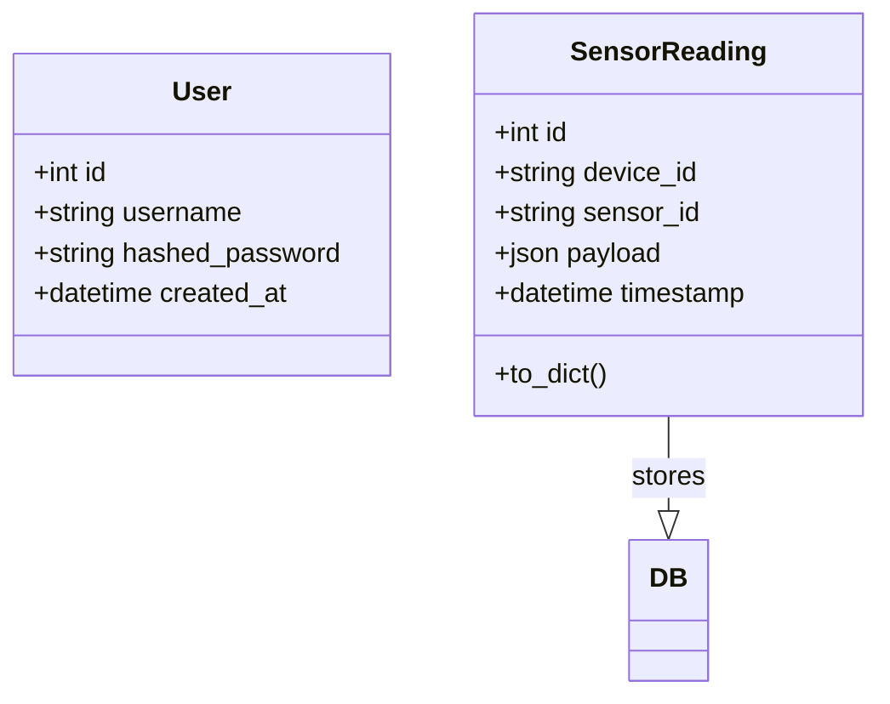

# Class Diagram (Database models)

What this shows
- The core persistence models present in the codebase: `User` and `SensorReading`.
- `SensorReading` stores raw payload JSON (value) and timestamp; this matches `backend/app/models/sensor_reading.py`.

Why this matters
- For a committee, this demonstrates the data model used for queries, history charts and predictions.
- It also clarifies design decisions (e.g., storing payload as JSON keeps the model flexible for sensor types).

How to present this to a jury
- Explain each attribute and how it maps to UI needs: `timestamp` + `payload.value` → history charts; `device_id` → device grouping.
- Be ready to justify storing `payload` as JSON (flexibility vs typed schema) and when you'd migrate to a typed schema (Postgres + JSONB or normalized columns).
