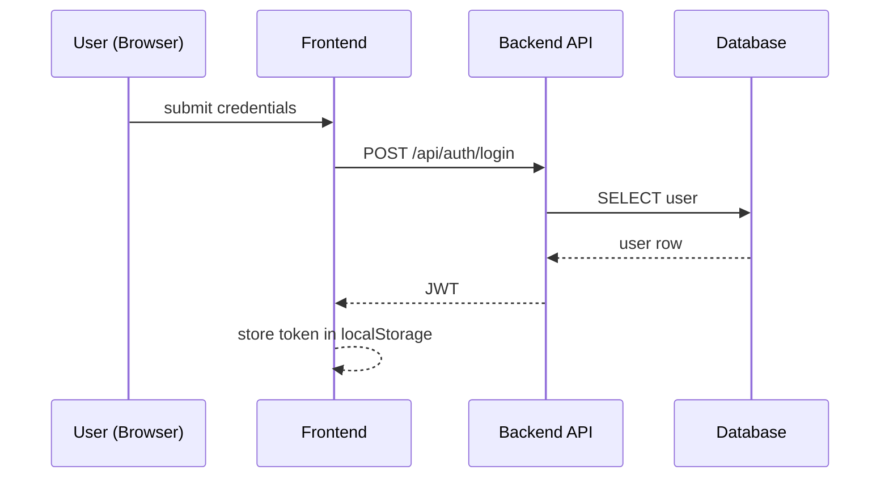
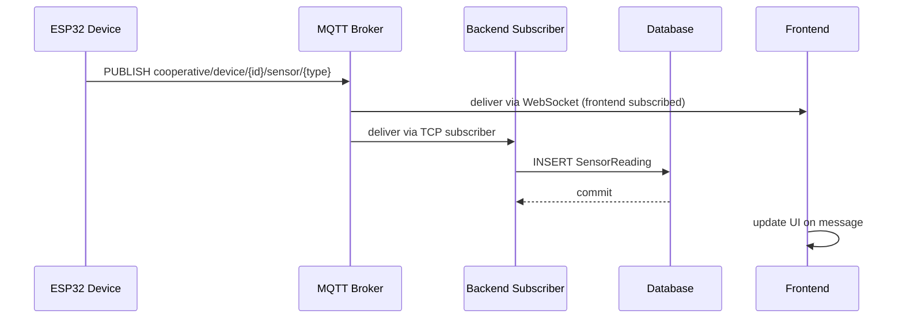

# Sequence Diagrams

## Login flow

## Real-time data flow (MQTT)

What this shows
- Two important runtime flows: auth/login and sensor ingestion (both the UI path and the persistence path).

How to present to a jury
- Walk the login flow first to show authentication and protected API access.
- Then show the data flow: emphasize the separation of concerns — broker for real-time delivery and a backend subscriber for persistence.
