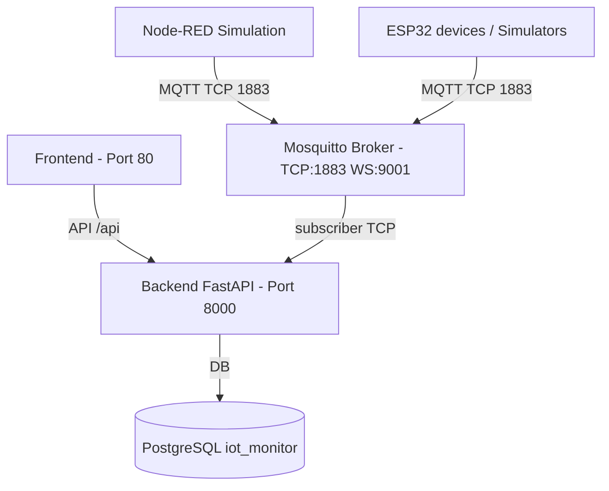

# Deployment Diagram (Docker topology)

What this shows
- The Dockerized network and ports used in the current stack: Node-RED/ESP32 -> Mosquitto -> backend persistence and dashboard API.

Why present this
- Committees want to see how components are deployed and connected: where network boundaries are, which ports, and what runs in Docker.

How to present to a jury
- Use this to explain the Docker demo setup (`docker-compose up -d --build`), MQTT broker ports, and PostgreSQL persistence.
