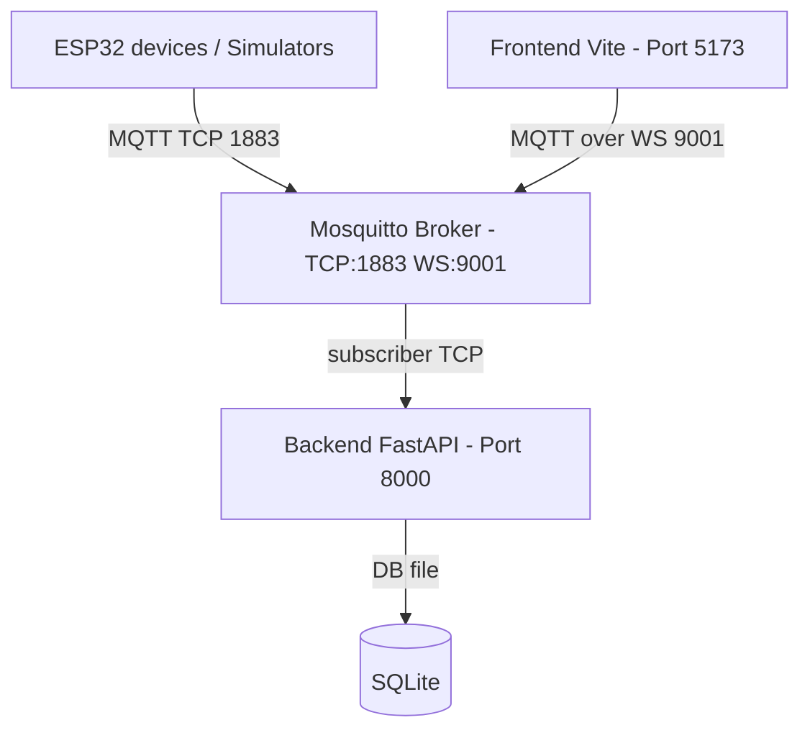

# Deployment Diagram (local dev topology)

What this shows
- The physical network and ports used during local development: simulators/devices → Mosquitto → backend persistence and frontend WS.

Why present this
- Committees want to see how components are deployed and connected: where network boundaries are, which ports, and what runs locally vs remotely.

How to present to a jury
- Use this to explain your dev demo setup (run_local_stack.sh, mosquitto conf with websocket listener, simulator process).
- Be prepared to justify choices: e.g., why WebSocket for frontend (browser compatibility) and why SQLite in dev (simplicity) vs Postgres in production.
