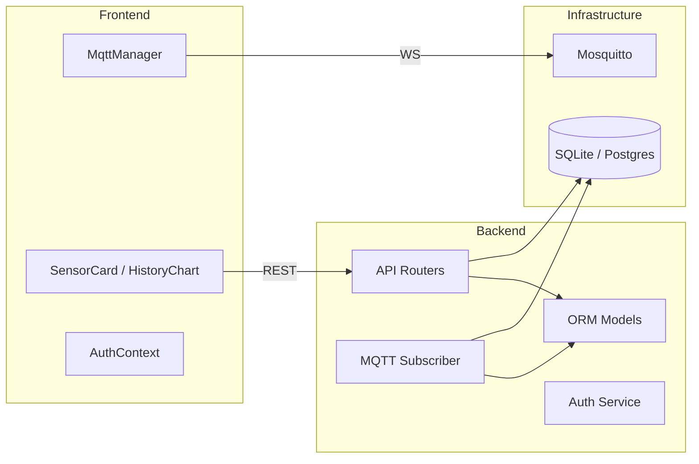

# Component Diagram (software components)

What this shows
- How responsibilities are split across the frontend and backend code (MQTT client logic, UI, API routers, persister/subscriber, and models).

How to present to a jury
- Describe each component's responsibility and why that separation matters (testability, single responsibility, independent scaling: broker vs backend).
- Mention testing/demo strategy per component (simulator for devices, mock mode in the frontend, DB snapshot for history).
